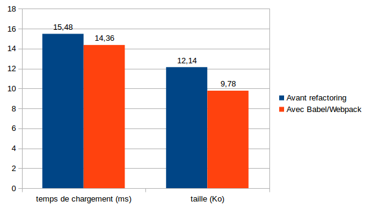

Actuellement je travaille sur un site web en mode SaaS pour travailleurs indépendants et professions libérales. Comme le javascript n'était pas ma tasse de thé, j'avais négligé cet aspect, en accumulant le minimum de code (backbone/semantic-ui) dans de petits fichiers qui commençaient à grossir. Conscient de cette dette technique qui s'y accumulait, il y a une dixaine de jours je suis allé aux Javascript Les 10 Doigts Dedans (ou [JSLDD](http://jsldd.org/) pour les intimes) afin de rencontrer des férus du JS qui pourraient me faire aimer un peu mieux le JS et prendre soin de cet aspect incontournable du site.

L'objectif est double :

- diminuer la dette technique : rationnaliser l'utilisation du JS dans le HTML, améliorer la testabilité du code JS, la lisibilité du code de production, s'ouvrir des portes d'amélioration du design du code (par ex pouvoir intégrer plus simplement des librairies comme [riot.js](http://riotjs.com/))
- diminuer la taille des pages, en minifiant les fichiers javascript du site (pour les librairies, j'utilisais déjà les versions minifiées)

*Et enfin, pouvoir apprécier cet écosystème du frontend ?*

J'ai binômé avec Paul qui m'a montré comment faire pour mettre en oeuvre une stack minimale ES6. En tant qu'expert frontend il m'a conseillé de mettre en place un build JS pour le code du front. Il m'a montré le gestionnaire de packets JS [yarn](https://yarnpkg.com/), [babel](https://babeljs.io/) pour la transpilation en ES5, [mocha](http://mochajs.org/) pour le test runner, [expect](https://github.com/Automattic/expect.js) pour les assertions. Nous avons pu transformer un bout de code que j'avais amené et des tests unitaires relatifs.

Emballé par le résultat, j'ai modifié la hiérarchie de mon source pour séparer code backend et code frontend. Puis j'ai repris tous les bouts de code javascript du site et les ai transformés pour qu'ils puissent passer à la moulinette babel. Même si je n'ai pas mis en oeuvre immédiatement toutes les possibilités de syntaxe offertes par ES6 (classes, etc), les impacts étaient assez importants.

Je n'aurais pas pu éviter des régressions sans **les tests unitaires JS et les tests d'acceptance sélénium**. J'ai ajouté [webpack](https://webpack.js.org/) pour pouvoir packager le code et le déployer dans le site.

J'ai voulu alors constater la diminution de la taille des pages. Je me suis dit qu'un manière possible était d'exécuter les tests d'acceptance avant et après refactoring, en mesurant la taille des pages avec tcpdump :

    sudo tcpdump -v  -i eth0 port 443 | grep -e 'length [0-9]*)' |  
      sed 's/.*length \([0-9]*\))/\1/' |  awk '{sum+=$1;print sum,$1}'

Je lance les tests, et observe les résultats :

Avant refactoring :

    30156494 203
    17126 packets captured

Après babel/webpack :

    33176994 52
    16874 packets captured

WOT ?!!? On observe moins de packets mais une **taille plus importante de 10%** environ.

Je vais voir ce qui se passe avec un navigateur. Je supprime le cache, charge la page de login et regarde ce que me dit firefox :

* 11 requêtes, **1.4 Mo** de transféré en 333ms avec :
* login.html : 2.6 Ko
* vendor.js : 733 Ko
* login.js : 664 octets

Avec l'ancienne version :

* 14 requêtes, **1 Mo** de transféré en 268ms avec :
* login.html : 3.1 Ko
* semantic.min.js : 269 Ko
* jquery.min.js : 82.6 Ko

Dans vendor.js, il y a semantic.js, jQuery.js, moment.js. Avant, j'avais des imports javascript un peu partout dans mon HTML (sauf jquery/semantic qui étaient dans le layout), c'était plus difficile à maintenir, mais c'était optimisé car je ne chargeais par exemple pickadate.js juste à l'endroit où j'avais des sélecteurs de date.

Une fois chargé, vendor.js est caché mais lorsque j'exécute les tests d'acceptance, à chaque feature, je relance un navigateur frais (pour l'isolation des tests). Chaque test ne passe pas forcément sur toutes les pages. Dans ces cas, moment/pickadate sont chargés systématiquement, ce qui n'était pas le cas avant.

Je continue mon auscultation de différentes pages du site, et relève les tailles et temps de chargement :

Si on fait la somme des tailles, il y a un léger avantage pour la version sans webpack/babel, mais si on exclut la première requête, le refactoring reprend l'avantage.

Pour simuler une utilisation plus longue, un injecteur de tests de charge pourrait aider. J'essaye [funkload](http://funkload.nuxeo.org/), sans succès car il charge les CSS et les images, mais pas le javascript. Par ailleurs, funkload trace le traffic réseau global mais pas la taille par page.

Je me reporte sur [JMeter](http://jmeter.apache.org/) que j'avais déjà utilisé il y a déjà quelque temps. Il faut dépasser l'IHM java/swing assez moche, se replonger dans les termes un peu baroques (Groupes d'unité, Fragment d'élément, récepteur d'assertions...) pour construire un plan de test.

Ne pas oublier de cliquer sur "récupérer les ressources incluses" dans les requêtes HTTP, puis d'ajouter un gestionnaire de cache HTTP pour qu'il se comporte comme un navigateur avec les dépendances Javascript/CSS/Images. Mais une fois configuré il fait bien son boulot, et me permet de faire 100 itérations avec un seul utilisateur sur un scénario qui charge toutes les pages. Ce scénario pourra toujours me resservir pour faire quelques tests de charge sur le serveur, je n'aurai qu'à modifier le paramètre du nombre d'utilisateurs concurrents.

A présent les résultats sont bien différents :

On passe d'une taille de page moyenne de **12,14 Ko à 9,78 Ko**, c'est à dire qu'on gagne **presque 25%**, avec un code JS plus clair et mieux intégré au HTML. Nous gagnons également **7% de temps de chargement** (sur un lien local entre 2 containers docker). Le jeu en valait la chandelle. En revanche, on peut voir que les résultats en terme de gains de bande passante d'un tel refactoring dépendent beaucoup de l'usage qui est fait du site par les utilisateurs. L'avantage, lorsque le pas a été franchi, c'est qu'on peut modifier assez facilement la structuration des fichiers source Javascript avec Webpack, pour adapter l'architecture des pages en fonction des usages.

L'étape suivante sera l'utilisation de fichiers javasript avec un hash code, pour recharger uniquement les fichiers modifiés. Actuellement nous utilisons des chemins virtuels avec la version du site. Cela oblige les navigateurs de chaque utilisateur à recharger toutes les resources (js/css/images) lorsque le site a évolué.

PS : merci à ut7 pour l'organisation du JSLDD et Paul pour son binômage instructif, ils sont l'étincelle qui m'a permis de faire l'allumage de ce refactoring.
